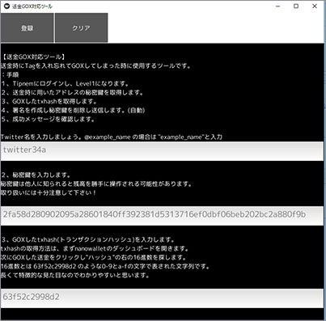
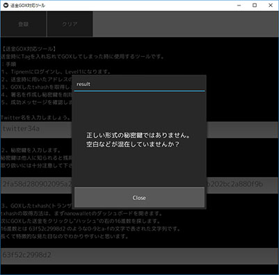

# tipnem-py の GOX TOOLをKivyでUIを付けたもの

=========

[GOX_TOOL](https://github.com/namuyan/tipnem-py/blob/master/GOX_TOOL.md)をKivyで書き直したアプリです。
Python3で作成

実行方法
```python

python main.py

```

## 実行例







## exeの作り方

Pytinstaller で作成

```python

 pyinstaller  .\main.spec
```

実行するとdistフォルダ内にmainディレクトリがあります。

mainフォルダ内にもmain.exeができます。

## Licence
MIT
